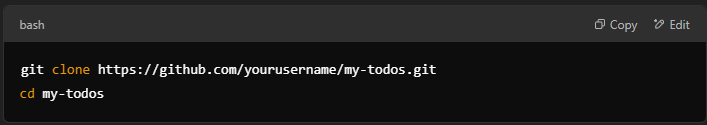
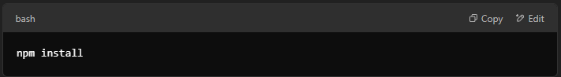
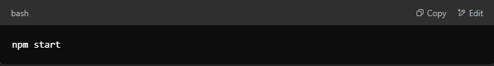

# My Todos
My Todos is a user-friendly web application designed to help you manage daily tasks efficiently. 

Features like Dark Mode ensure a comfortable experience in any lighting condition.

# Features
Add Tasks: Quickly add new tasks to your to-do list. 

Edit Tasks: Modify existing tasks to update details. 

Delete Tasks: Remove tasks that are no longer needed. 

Mark as Complete: Check off tasks as you complete them. 

Persistent Storage: Your tasks are saved and will persist between sessions. 

Dark Mode: Switch to a darker theme for comfortable use in low-light environments. 

# Getting Started
You can follow these instructions to set up and run the project locally.

## Prerequisites
Ensure you have the following installed:

Node.js (v14.x or later) 

npm (v6.x or later)

## Installation
Clone the Repository:

Install Dependencies:

Start the Application:

The application should now be running on http://localhost:3000.

## Usage
1. Adding a Task: Enter your task description in the input field and press "Add" or hit Enter. 

2. Editing a Task: Click on the task you wish to edit, make your changes, and press "Save". 

3. Deleting a Task: Click the delete icon next to the task to remove it. 

4. Marking as Complete: Click the checkbox next to a task to mark it as completed. 

5. Toggling Dark Mode: Click the moon icon in the top-right corner to switch between light and dark themes. 

## Technologies Used :
= Frontend: HTML, CSS, JavaScript 

= Backend: Node.js, Express.js 

= Database: MongoDB (via Mongoose) 

## Contributing
### Contributions are welcome! To contribute:
Fork the repository.

Create a new branch: `git checkout -b feature/your-feature-name` 

Make your changes and commit them: `git commit -m 'Add some feature'` 

Push to the branch: `git push origin feature/your-feature-name` 

Open a pull request. 

